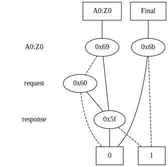

# DFA Representations {#p02_api_example_dfa_representation}

In this example, we will explore the C++ API to translate the DFA between different representations.

The code of this example can be found in the file `examples/02_dfa_representation/dfa_representation.cpp`.
To build this example, you can run `make dfa_representation_example`.

```cpp
#include <memory>
#include <sstream>
#include <string>
#include <vector>

#include <lydia/parser/ltlf/driver.hpp>

#include "automata/ExplicitStateDfa.h"
#include "automata/ExplicitStateDfaAdd.h"
#include "automata/SymbolicStateDfa.h"
#include "VarMgr.h"
#include "lydia/mona_ext/mona_ext_base.hpp"


int main(int argc, char ** argv) {

    // explicit DFA
    std::string request = "request";
    std::string response = "response";
    std::string formula_str = "G(request -> F(response))";
    std::cout << "Input formula: " << formula_str << std::endl;

    // parse the formula
    auto driver = std::make_shared<whitemech::lydia::parsers::ltlf::LTLfDriver>();
    std::stringstream formula_stream(formula_str);
    driver->parse(formula_stream);
    whitemech::lydia::ltlf_ptr formula = driver->get_result();

    // build the explicit-state DFA
    Syft::ExplicitStateDfa dfa = Syft::ExplicitStateDfa::dfa_of_formula(*formula);

    std::cout << "Printing the DFA in textual form: " << std::endl;
    dfa.dfa_print();

    // export the DFA in MONA format
    std::cout << "Printing the DFA in MONA format..." << std::endl;
    dfa.export_dfa("main.mona");

    // export the DFA in DOT and SVG formats:
    std::cout << "Exporting the explicit-state MONA DFA in DOT and SVG to files 'main.dot' and 'main.svg'..." << std::endl;
    whitemech::lydia::print_mona_dfa(
        dfa.dfa_,
        "main",
        dfa.get_nb_variables()
    );

    // transform in explicit state form with ADD
    std::shared_ptr<Syft::VarMgr> var_mgr = std::make_shared<Syft::VarMgr>();
    var_mgr->create_named_variables({request, response});
    Syft::ExplicitStateDfaAdd explicit_dfa_add = Syft::ExplicitStateDfaAdd::from_dfa_mona(var_mgr, dfa);
    std::cout << "Number of states: " << explicit_dfa_add.state_count() << std::endl;
    std::cout << "Exporting the explicit-state ADD DFA in DOT format to file 'main_add.dot'..." << std::endl;
    explicit_dfa_add.dump_dot("main_add.dot");

    // build the symbolic-state DFA from the explicit-state DFA
    Syft::SymbolicStateDfa symbolic_dfa = Syft::SymbolicStateDfa::from_explicit(std::move(explicit_dfa_add));
    std::cout << "Exporting the symbolic-state DFA in DOT format to file 'main_symbolic.dot'..." << std::endl;
    symbolic_dfa.dump_dot("main_symbolic.dot");

    return 0;
}
```

In this example, we consider the DFA associated to the LTLf formula `G(request -> F(response))`.

### Build a DFA from a LTLf formula

First, we define our LTLf formula `G(request -> F(response))` and parse it using the Lydia LTLf parser:

```cpp
// build the formula
std::string request = "request";
std::string response = "response";
std::string formula_str = "G(request -> F(response))";
std::cout << "Input formula: " << formula_str << std::endl;

// parse the formula
auto driver = std::make_shared<whitemech::lydia::parsers::ltlf::LTLfDriver>();
std::stringstream formula_stream(formula_str);
driver->parse(formula_stream);
whitemech::lydia::ltlf_ptr formula = driver->get_result();
```

### Explicit DFA representation (MONA-based)

Next, we use the function `Syft::ExplicitStateDfa::dfa_of_formula` to build the DFA starting from the LTLf formula,
in explicit-state representation, (in particular, in the MONA representation):

```cpp
// build the explicit-state DFA
Syft::ExplicitStateDfa dfa = Syft::ExplicitStateDfa::dfa_of_formula(*formula);
```

The DFA can be exported in several formats:

- In textual form:

```cpp
std::cout << "Printing the DFA in textual form: " << std::endl;
dfa.dfa_print();
```

This will print to stdout:

```
Printing the DFA in textual form: 
Computed automaton: 
DFA for formula with free variables: request response 
Initial state: 0
Accepting states: 0 
Rejecting states: 1 

Automaton has 2 state(s) and 4 BDD-node(s)
Transitions:
State 0: 0X -> state 0
State 0: 10 -> state 1
State 0: 11 -> state 0
State 1: X0 -> state 1
State 1: X1 -> state 0
```

For details on how to interpret the output, we refer to the [MONA manual](https://www.brics.dk/mona/mona14.pdf) (Section 2.4: "Outputting the program automaton").

Another way to export the MONA DFA is by using the function `Syft::ExplicitStateDfa::export_dfa`:

```cpp
// export the DFA in MONA format
std::cout << "Printing the DFA in MONA format: " << std::endl;
dfa.export_dfa("main.mona");
```

This code will create the file `main.mona` with the following content: 

```
MONA DFA
number of variables: 2
variables: request response
orders: 2 2
states: 2
initial: 0
bdd nodes: 4
final: 1 -1
behaviour: 0 1
bdd:
 0 2 1
 1 3 2
 -1 0 0
 -1 1 0
end
```

This format is not meant to be human-friendly , since it prints the transition function by specifying the BDD nodes.
More details on this format can be found in "Section C.1 Using DFA files" of the [MONA manual](https://www.brics.dk/mona/mona14.pdf).

We can also print the DFA in DOT and SVG formats using the function `whitemech::lydia::print_mona_dfa` from Lydia:

```cpp
// export the DFA in DOT and SVG formats:
std::cout << "Exporting the explicit-state MONA DFA in DOT and SVG to files 'main.dot' and 'main.svg'..." << std::endl;
whitemech::lydia::print_mona_dfa(
    dfa.dfa_,
    "main",
    dfa.get_nb_variables()
);
```

Output in `main.svg`:


### Explicit DFA representation (ADD-based)

Another DFA representation supported by LydiaSyft is the one based on Algebraic Decision Diagrams (ADD), 
implemented by the class `Syft::ExplicitStateDfaAdd`.
The following code produces an instance of `Syft::ExplicitStateDfaAdd` starting from an instance of `Syft::ExplicitStateDfa` constructed above:

```cpp
// transform in explicit state form with ADD
std::shared_ptr<Syft::VarMgr> var_mgr = std::make_shared<Syft::VarMgr>();
var_mgr->create_named_variables({request, response});
Syft::ExplicitStateDfaAdd explicit_dfa_add = Syft::ExplicitStateDfaAdd::from_dfa_mona(var_mgr, dfa);
explicit_dfa_add.dump_dot("main_add.dot");
```

Similar to the previous case, we can print the DFA in DOT format:

```
std::cout << "Number of states: " << explicit_dfa_add.state_count() << std::endl;
std::cout << "Exporting the explicit-state ADD DFA in DOT format to file 'main_add.dot'..." << std::endl;
explicit_dfa_add.dump_dot("main_add.dot");
```

The file `main_add.dot` can then be printed in SVG:


The image shows the transition function in ADD form. 
The root nodes and leaf nodes correspond to the DFA states, 
while the BDD nodes in the middle encode the decision nodes for each variable of the alphabet.

### Symbolic DFA representation

LydiaSyft also supports the DFA in _(fully) symbolic_ representation.
That is, both the state space and the transition function are represented using symbols (or _bits_) rather than explicitly.
The LydiaSyft class that implements such representation is `Syft::SymbolicStateDfa`.

Continuing with the example above, we can easily construct a symbolic DFA starting from an ADD-based explicit DFA
using the function `Syft::SymbolicStateDfa::from_explicit`:

```cpp
// build the symbolic-state DFA from the explicit-state DFA
Syft::SymbolicStateDfa symbolic_dfa = Syft::SymbolicStateDfa::from_explicit(std::move(explicit_dfa_add));
```

We can visualize the DFA by exporting the BDDs in DOT format:

```cpp
std::cout << "Exporting the symbolic-state DFA in DOT format to file 'main_symbolic.dot'..." << std::endl;
symbolic_dfa.dump_dot("main_symbolic.dot");
```

The SVG corresponding to `main_symbolic.dot` is:



As you can see, differently from the previous case, 
now we have the root nodes (top-left), one for each bit, from where we compute its next value.
The first decision node determines the current state. 
In this case, we need to determine whether we are evaluating the transition function from the state `0` or from the state `1`.
The other decision nodes determine the symbol to be read. 
The final value determines the value of the bit we started from.

The other root node, `Final`, represents the set of final states in symbolic form.
That is, if the evaluation of the current state, starting from the `Final` node, 
returns `0`, then the state is not in the set of final state,
while the opposite holds if the evaluation returns `1`.