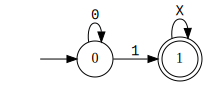
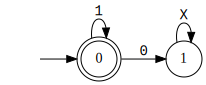
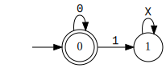
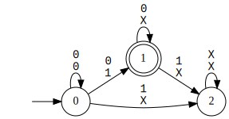
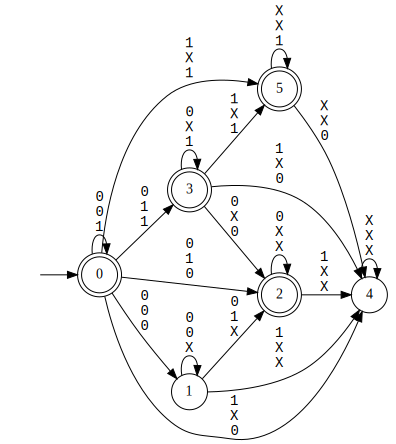

# DFA Creation and Manipulation {#p03_api_example_dfa_creation_and_manipulation}

In this section, we see APIs to create and compose DFAs.
The code for this example can be found in `examples/03_dfa_creation_and_manipulation/dfa_creation_and_manipulation.cpp`.
To build this example, you can run `make dfa_creation_and_manipulation_example`.

```cpp
#include <sstream>
#include <lydia/parser/ltlf/driver.hpp>
#include <lydia/mona_ext/mona_ext_base.hpp>

#include "automata/ExplicitStateDfa.h"


int main(int argc, char ** argv) {

    std::string formula_p_str = "F(p)";
    std::string formula_q_str = "F(q)";
    std::string formula_r_str = "G(r)";

    // parse the formulas
    auto driver = std::make_shared<whitemech::lydia::parsers::ltlf::LTLfDriver>();
    std::stringstream formula_p_stream(formula_p_str);
    driver->parse(formula_p_stream);
    whitemech::lydia::ltlf_ptr formula_p = driver->get_result();

    std::stringstream formula_q_stream(formula_q_str);
    driver->parse(formula_q_stream);
    whitemech::lydia::ltlf_ptr formula_q = driver->get_result();

    std::stringstream formula_r_stream(formula_r_str);
    driver->parse(formula_r_stream);
    whitemech::lydia::ltlf_ptr formula_r = driver->get_result();

    // build the explicit-state DFAs
    Syft::ExplicitStateDfa dfa_p = Syft::ExplicitStateDfa::dfa_of_formula(*formula_p);
    Syft::ExplicitStateDfa dfa_q = Syft::ExplicitStateDfa::dfa_of_formula(*formula_q);
    Syft::ExplicitStateDfa dfa_r = Syft::ExplicitStateDfa::dfa_of_formula(*formula_r);

    // print in DOT and SVG
    whitemech::lydia::print_mona_dfa(
            dfa_p.dfa_,
            "dfa_Fp",
            dfa_p.get_nb_variables()
    );
    whitemech::lydia::print_mona_dfa(
            dfa_q.dfa_,
            "dfa_Fq",
            dfa_q.get_nb_variables()
    );
    whitemech::lydia::print_mona_dfa(
            dfa_r.dfa_,
            "dfa_Fr",
            dfa_r.get_nb_variables()
    );

    // complement of dfa_p
    Syft::ExplicitStateDfa not_dfa_p = Syft::ExplicitStateDfa::dfa_complement(dfa_p);
    whitemech::lydia::print_mona_dfa(
            not_dfa_p.dfa_,
            "dfa_not_Fp",
            not_dfa_p.get_nb_variables()
    );

    // intersection of not_dfa_p and dfa_q
    Syft::ExplicitStateDfa and_dfa = Syft::ExplicitStateDfa::dfa_product_and({not_dfa_p, dfa_q});
    whitemech::lydia::print_mona_dfa(
            and_dfa.dfa_,
            "dfa_not_Fp_and_Fq",
            and_dfa.get_nb_variables()
    );

    // union of and_dfa and dfa_r
    Syft::ExplicitStateDfa or_dfa = Syft::ExplicitStateDfa::dfa_product_or({and_dfa, dfa_r});
    whitemech::lydia::print_mona_dfa(
            or_dfa.dfa_,
            "dfa_not_Fp_and_Fq_or_Gr",
            or_dfa.get_nb_variables()
    );

}
```

First, we define the DFAs for the LTLf formulas `F(p)`, `F(q)`, and `G(r)`:

```cpp
std::string formula_p_str = "F(p)";
std::string formula_q_str = "F(q)";
std::string formula_r_str = "G(r)";

// parse the formulas
auto driver = std::make_shared<whitemech::lydia::parsers::ltlf::LTLfDriver>();
std::stringstream formula_p_stream(formula_p_str);
driver->parse(formula_p_stream);
whitemech::lydia::ltlf_ptr formula_p = driver->get_result();

std::stringstream formula_q_stream(formula_q_str);
driver->parse(formula_q_stream);
whitemech::lydia::ltlf_ptr formula_q = driver->get_result();

std::stringstream formula_r_stream(formula_r_str);
driver->parse(formula_r_stream);
whitemech::lydia::ltlf_ptr formula_r = driver->get_result();

// build the explicit-state DFAs
Syft::ExplicitStateDfa dfa_p = Syft::ExplicitStateDfa::dfa_of_formula(*formula_p);
Syft::ExplicitStateDfa dfa_q = Syft::ExplicitStateDfa::dfa_of_formula(*formula_q);
Syft::ExplicitStateDfa dfa_r = Syft::ExplicitStateDfa::dfa_of_formula(*formula_r);

// print in DOT and SVG
whitemech::lydia::print_mona_dfa(
        dfa_p.dfa_,
        "dfa_Fp",
        dfa_p.get_nb_variables()
);
whitemech::lydia::print_mona_dfa(
        dfa_q.dfa_,
        "dfa_Fq",
        dfa_q.get_nb_variables()
);
whitemech::lydia::print_mona_dfa(
        dfa_r.dfa_,
        "dfa_Fr",
        dfa_r.get_nb_variables()
);
```

The three DFAs are visualized below in SVG format:





Next, we compute the complement of the DFA for `F(p)`, with the function `Syft::ExplicitStateDfa::dfa_complement`: 

```cpp
// complement of dfa_p
Syft::ExplicitStateDfa not_dfa_p = Syft::ExplicitStateDfa::dfa_complement(dfa_p);
whitemech::lydia::print_mona_dfa(
        not_dfa_p.dfa_,
        "dfa_not_Fp",
        not_dfa_p.get_nb_variables()
);
```




The intersection between two DFAs can be computed using the function `Syft::ExplicitStateDfa::dfa_product_and`.
In the following, we compute the intersection between the DFAs of `!F(p)` and `F(q)`:

```cpp
// intersection of not_dfa_p and dfa_q
Syft::ExplicitStateDfa and_dfa = Syft::ExplicitStateDfa::dfa_product_and({not_dfa_p, dfa_q});
whitemech::lydia::print_mona_dfa(
        and_dfa.dfa_,
        "dfa_not_Fp_and_Fq",
        and_dfa.get_nb_variables()
);
```




Finally, we compute the union between the unione between the DFAs of `!F(p) & F(q)` and `G(r)`:

```cpp
// union of and_dfa and dfa_r
Syft::ExplicitStateDfa or_dfa = Syft::ExplicitStateDfa::dfa_product_or({and_dfa, dfa_r});
whitemech::lydia::print_mona_dfa(
        or_dfa.dfa_,
        "dfa_not_Fp_and_Fq_or_Gr",
        or_dfa.get_nb_variables()
);
```




Other operations can be found in the header file `automata/ExplicitStateDfa.h`.

For the symbolic DFA representation, the corresponding functions are `SymbolicStateDfa::complement`, `SymbolicStateDfa::product_AND`, and `SymbolicStateDfa::product_OR`. 
Such functions can be found in `automata/SymbolicStateDfa.h`.
